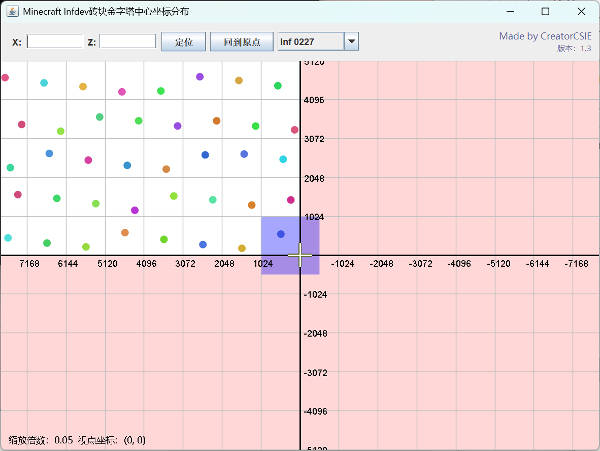

# [English](README.md) [中文](README-ZH.md)

# Infdev Pyramid Position Mapping - 一款由CreatorCSIE制作的小程序

**一种使用简单程序直观查看Infdev砖块金字塔及其坐标的解决方案**

# 功能
* 你可以单击上面的点得知坐标。
* 点非常五颜六色。
* 超过33554432坐标不再绘制点。
* 如果你不知道坐标，可以使用模糊搜索来定位其最近的金字塔。
* 你可以回到原点。
* 你可以用一个下拉菜单切换Infdev版本。

# 适用范围
* **Minecraft Infdev** `20100227`~`20100325`

# 程序截图

# 发布
* 在[Releases](https://github.com/CreatorCSIE/Infdev-Pyramid-Position-Mapping/releases)下载已发布的版本。

* 左键双击jar或者在命令提示符下用`java -jar BrickMapping.jar`运行此程序

# 构建
下载这个项目的源代码（用git clone也可以）。在项目根目录运行`compile.bat`即可编译并把`BrickMapping.jar`打包到项目根目录，也可以使用Eclipse、IntelliJ IDEA等IDE编译。

示例（使用了git clone）:

`git clone https://github.com/CreatorCSIE/Infdev-Pyramid-Position-Mapping.git`

# 运行
编译完成后，双击`run.bat`，或运行`java -jar BrickMapping.jar`启动程序。

# Credits
* **CreatorCSIE (myself)**
